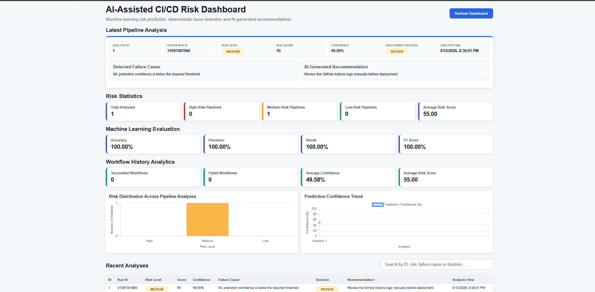
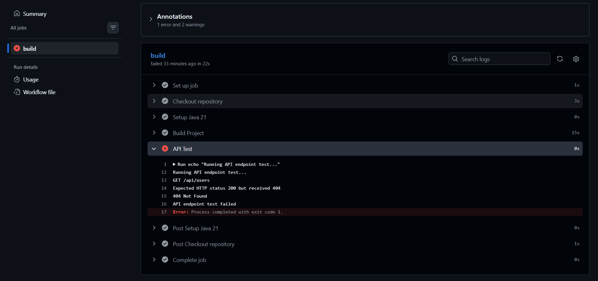
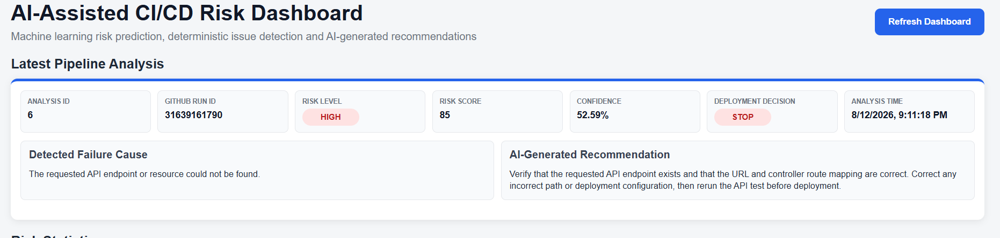
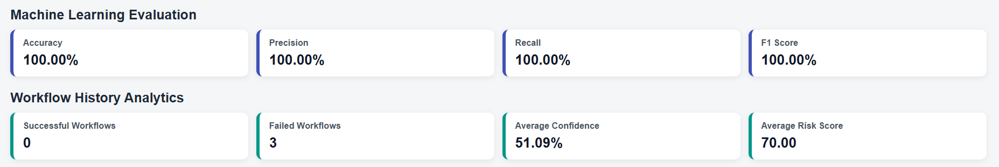

# AI-Assisted CI/CD Pipeline Risk Analyzer for Cloud-Native Applications

## Project Overview

The **AI-Assisted CI/CD Pipeline Risk Analyzer** is designed to analyse CI/CD pipeline executions and identify potential deployment risks before an application is deployed.

The system integrates with **GitHub Actions** to retrieve workflow information and job logs. A machine learning model analyses pipeline information and predicts the deployment risk. A rule-based issue detection service then analyses the actual CI/CD logs to identify the specific technical failure.

Based on the detected failure cause, a locally hosted **Ollama Large Language Model (LLM)** generates an actionable recommendation explaining how the issue can be investigated or resolved.

The complete analysis is stored in PostgreSQL and presented through a web dashboard.

---

## Project Objectives

The main objectives of this project are:

- Analyse GitHub Actions CI/CD pipeline executions.
- Predict deployment risk using machine learning.
- Classify pipelines as **LOW, MEDIUM, or HIGH risk**.
- Generate a numerical risk score.
- Provide prediction confidence.
- Detect specific technical issues from CI/CD workflow logs.
- Generate actionable recommendations for detected failures.
- Support deployment decisions such as **PROCEED, REVIEW, or STOP**.
- Store previous pipeline analyses for historical evaluation.
- Present results through an interactive dashboard.

---

## Main Features

- GitHub Actions integration
- Automatic workflow information retrieval
- GitHub Actions job-log collection
- Machine learning risk prediction
- LOW, MEDIUM, and HIGH risk classification
- Risk score generation
- Prediction confidence
- Rule-based CI/CD issue detection
- AI-generated recommendations using Ollama
- Deployment decision generation
- PostgreSQL persistence
- Historical pipeline analysis
- Risk statistics
- Machine learning evaluation metrics
- Risk distribution visualisation
- Confidence trend visualisation
- Searchable analysis history
- Interactive web dashboard
- Docker-based deployment

---

## System Architecture

The main system architecture is:

```text
GitHub Actions
      |
      v
Workflow Run + Job Logs
      |
      v
Spring Boot Backend
      |
      +-----------------------------+
      |                             |
      v                             v
Machine Learning              Issue Detection
Risk Prediction                  Service
      |                             |
      v                             v
Risk Level                  Failure Cause
Risk Score                        |
Confidence                        v
Deployment Decision          Ollama LLM
      |                             |
      |                             v
      |                     AI Recommendation
      |                             |
      +-------------+---------------+
                    |
                    v
              PostgreSQL
                    |
                    v
               Dashboard
```

---

## System Workflow

The system performs the following steps:

1. A CI/CD workflow executes using GitHub Actions.
2. The Spring Boot application retrieves the latest GitHub Actions workflow information.
3. The corresponding workflow job logs are downloaded.
4. Pipeline information is sent to the machine learning service.
5. The ML model predicts the pipeline risk level.
6. A risk score and prediction confidence are generated.
7. A deployment decision is produced.
8. The `IssueDetectionService` analyses the workflow log.
9. The service identifies the specific technical failure from the log.
10. The detected failure cause is provided to Ollama.
11. Ollama generates an actionable recommendation.
12. The complete analysis is stored in PostgreSQL.
13. The results are displayed through the web dashboard.

---

## Technologies Used

### Backend

- Java 21
- Spring Boot
- Spring Data JPA
- Maven
- REST APIs

### Machine Learning

- Python
- scikit-learn
- TF-IDF
- Machine learning classification
- Joblib
- Pandas

### Artificial Intelligence

- Ollama
- Local Large Language Model (LLM)

### DevOps

- GitHub Actions
- Docker
- Docker Compose
- Git
- GitHub

### Database

- PostgreSQL

### Frontend

- HTML
- CSS
- JavaScript
- Chart.js

### Testing

- Postman
- GitHub Actions test workflows

---

## Machine Learning Risk Analysis

The machine learning component analyses CI/CD workflow information and predicts the deployment risk.

The system uses three risk levels:

### LOW

The pipeline is considered low risk and can normally proceed toward deployment.

```text
Deployment Decision: PROCEED
```

### MEDIUM

The pipeline contains warnings or conditions that require additional review.

```text
Deployment Decision: REVIEW
```

### HIGH

The pipeline contains significant failures that should be resolved before deployment.

```text
Deployment Decision: STOP
```

The machine learning component provides:

- Risk level
- Risk score
- Prediction confidence
- Deployment decision

The model is evaluated using:

- Accuracy
- Precision
- Recall
- F1 Score
- Confusion Matrix

---

## CI/CD Issue Detection

The `IssueDetectionService` analyses the GitHub Actions job log to identify the actual technical issue responsible for a pipeline failure.

The service supports multiple CI/CD failure patterns, including:

- Unit test failures
- Assertion failures
- HTTP 500 responses
- Test timeouts
- Mockito verification failures
- Maven build failures
- Compilation failures
- Maven dependency resolution failures
- Gradle build failures
- Spring Bean creation failures
- Missing Spring Beans
- Spring Boot application context failures
- Application startup failures
- Port conflicts
- Docker build failures
- Docker image failures
- Docker authentication failures
- Docker push failures
- Kubernetes `ImagePullBackOff`
- Kubernetes `ErrImagePull`
- Kubernetes `CrashLoopBackOff`
- Kubernetes deployment failures
- Kubernetes pod failures
- Database connection failures
- SQL exceptions
- Database authentication failures
- Database timeouts
- HTTP 401 errors
- HTTP 403 errors
- HTTP 404 errors
- NullPointerException
- OutOfMemoryError
- StackOverflowError
- Missing files
- SSL certificate errors
- Permission errors
- Pipeline timeouts
- Non-zero process exit codes

Specific technical failures are prioritised over generic errors such as:

```text
Process completed with exit code 1
```

This allows the system to provide a more meaningful explanation of why the pipeline failed.

---

## AI-Generated Recommendations

After identifying the failure cause, the system sends the detected issue to a locally running Ollama model.

The LLM acts as an additional recommendation component rather than performing the primary failure detection.

The model receives:

- Detected failure cause
- Machine learning risk level

It then generates a practical recommendation explaining how the issue should be investigated or resolved before deployment.

### Example

Detected failure:

```text
UserServiceTest failed because the endpoint returned HTTP 500
instead of the expected HTTP 200.
```

The system can generate a recommendation such as:

```text
Investigate the UserService backend logs to identify the exception
causing the HTTP 500 response, correct the failing application logic,
rerun the test, and verify that the endpoint returns HTTP 200 before
deployment.
```

This combination provides both:

```text
WHAT failed -> IssueDetectionService

WHAT should be done -> Ollama
```

---

## Risk Analysis Output

A pipeline analysis contains information such as:

```json
{
  "id": 90,
  "source": "GitHub Actions",
  "riskLevel": "HIGH",
  "riskScore": 85,
  "confidence": 0.5216,
  "deploymentDecision": "STOP",
  "recommendation": "Investigate the backend service to identify the cause of the HTTP 500 response before deployment.",
  "failureCause": "UserServiceTest failed because the endpoint returned HTTP 500 instead of the expected HTTP 200."
}
```

---

## Installation and Setup

### Prerequisites

Before running the project, install:

- Java 21
- Maven
- Git
- Docker Desktop
- Ollama

Verify Java:

```bash
java -version
```

Verify Maven:

```bash
mvn -version
```

Verify Docker:

```bash
docker --version
```

Verify Git:

```bash
git --version
```

Verify Ollama:

```bash
ollama --version
```

---

## Clone the Repository

Clone the GitHub repository:

```bash
git clone https://github.com/mebin22/ai-cicd-risk-analyzer
```

Navigate to the project directory:

```bash
cd ai-cicd-risk-analyzer


## Ollama Setup

The project uses Ollama to generate recommendations locally.

Install Ollama and pull the configured model.

For example:

```bash
ollama pull llama3.2:3b
```

Check that the model is available:

```bash
ollama list
```

Ensure Ollama is running before performing an AI-assisted pipeline analysis.

The Ollama URL and model configured in the Spring Boot application must match the local Ollama environment.

---

## Running the Application

The project can be started using Docker Compose.

Build the services:

```bash
docker compose build
```

Start the services:

```bash
docker compose up -d
```

Alternatively, rebuild the Spring Boot service without using the Docker cache:

```bash
docker compose build --no-cache springboot-app
```

Then recreate the service:

```bash
docker compose up -d --force-recreate springboot-app
```

Check running containers:

```bash
docker compose ps
```

---

## Checking Application Logs

Spring Boot container logs can be checked using:

```bash
docker logs --tail 100 risk-springboot-app
```

For more log output:

```bash
docker logs --tail 200 risk-springboot-app
```

---

## Running the Dashboard

After the application starts successfully, open:

```text
http://localhost:8080/dashboard.html
```

The dashboard displays the results of pipeline analyses.

---

## Analysing the Latest GitHub Actions Workflow

The latest workflow can be analysed using:

```text
POST /api/github/analyze-latest
```

For local development:

```text
POST http://localhost:8080/api/github/analyze-latest
```

This operation:

1. Retrieves the latest GitHub Actions workflow.
2. Downloads the workflow job log.
3. Performs machine learning risk prediction.
4. Detects the technical failure.
5. Generates an Ollama recommendation.
6. Determines the deployment decision.
7. Saves the result in PostgreSQL.
8. Makes the analysis available to the dashboard.

---

## Additional API Endpoints

### Latest GitHub Workflow

```text
GET /api/github/latest-run
```

### Latest GitHub Job Logs

```text
GET /api/github/logs
```

### Latest GitHub Run ID

```text
GET /api/github/run-id
```

### Workflow Summary

```text
GET /api/github/summary
```

### Machine Learning Metrics

```text
GET /api/ml/metrics
```

---

## Dashboard

The dashboard provides a visual overview of CI/CD deployment risk.

It includes:

- Latest pipeline analysis
- Analysis ID
- GitHub run ID
- Risk level
- Risk score
- Prediction confidence
- Deployment decision
- Failure cause
- AI-generated recommendation
- Analysis timestamp
- Total analyses
- HIGH-risk pipeline count
- MEDIUM-risk pipeline count
- LOW-risk pipeline count
- Average risk score
- Machine learning accuracy
- Precision
- Recall
- F1 score
- Successful workflow count
- Failed workflow count
- Average prediction confidence
- Risk distribution chart
- Prediction confidence trend
- Recent analysis history
- Search functionality

---

## Screenshots

### Dashboard



### GitHub Actions



### Pipeline Risk Analysis – HTTP 404 Failure



### Machine Learning Model Evaluation


-->

---

## Evaluation Scenarios

The system has been tested using different CI/CD scenarios.

Examples include:

| Scenario | Expected Risk | Deployment Decision |
|---|---|---|
| Successful Build | LOW | PROCEED |
| Warning Scenario | MEDIUM | REVIEW |
| Unit Test Failure | HIGH | STOP |
| HTTP 500 Test Failure | HIGH | STOP |
| Compilation Failure | HIGH | STOP |
| Docker Build Failure | HIGH | STOP |
| Database Connection Failure | HIGH | STOP |
| Kubernetes Failure | HIGH | STOP |
| API Failure | HIGH | STOP |
| Runtime Failure | HIGH | STOP |

The evaluation verifies:

- Risk classification
- Risk scoring
- Prediction confidence
- Failure-cause detection
- AI recommendation generation
- Deployment decision generation

---

## Example Failure Scenario

A GitHub Actions workflow can produce a failure such as:

```text
Running UserServiceTest...
Expected HTTP status 200 but received 500
AssertionError: expected 200 but was 500
UserServiceTest failed
Process completed with exit code 1
```

The system identifies the more specific issue instead of simply reporting:

```text
Process completed with exit code 1
```

The detected failure cause can therefore be:

```text
UserServiceTest failed because the endpoint returned HTTP 500
instead of the expected HTTP 200.
```

The pipeline can then be classified as HIGH risk with a deployment decision of:

```text
STOP
```

Ollama generates a recommendation based on the detected failure.

---

## Database Persistence

Pipeline analyses are stored in PostgreSQL.

Stored information includes:

- Analysis ID
- GitHub workflow run ID
- Risk level
- Risk score
- Prediction confidence
- Failure cause
- AI recommendation
- Deployment decision
- Workflow logs
- Analysis timestamp

This enables historical pipeline analysis and dashboard visualisation.

---

## Known Limitations

The current implementation has several limitations:

- The system currently focuses primarily on GitHub Actions.
- Issue detection relies on recognisable patterns within CI/CD logs.
- New or previously unseen error formats may require additional detection rules.
- AI recommendation quality depends on the locally configured Ollama model.
- Ollama inference performance depends on the available computer resources.
- Machine learning performance depends on the quality and diversity of the training dataset.
- The system provides deployment decision support rather than automatically deploying or blocking production releases.
- Broader evaluation using real-world CI/CD datasets would improve external validation.

---

## Future Work

Future improvements could include:

- Jenkins integration.
- GitLab CI/CD integration.
- Azure DevOps integration.
- Larger real-world CI/CD datasets.
- Additional failure-detection patterns.
- More advanced root-cause analysis.
- Explainable AI for machine learning predictions.
- Automated alerts for HIGH-risk pipelines.
- Email or messaging notifications.
- Continuous model retraining.
- Cloud deployment.
- Enhanced security analysis.
- Additional dashboard analytics.
- Comparison of multiple machine learning models.

---

## Security Considerations

Sensitive information should never be committed to the GitHub repository.

Examples include:

- GitHub personal access tokens
- API keys
- Database passwords
- Private credentials
- Environment-specific secrets

Environment variables or secure secret-management mechanisms should be used for sensitive configuration.

Before final submission, verify that no credentials are present in the Git history or current repository.

---

## Project Structure

A simplified representation of the project is:

```text
ai-cicd-risk-analyzer/
│
├── .github/
│   └── workflows/
│
├── ml-risk-model/
│   ├── app.py
│   ├── train_model.py
│   ├── test_model.py
│   ├── training_dataset.csv
│   └── risk_model.pkl
│
├── src/
│   └── main/
│       ├── java/
│       │   └── com/mabin/riskanalyzer/
│       │       ├── controller/
│       │       ├── dto/
│       │       ├── model/
│       │       ├── repository/
│       │       └── service/
│       │
│       └── resources/
│           ├── static/
│           │   └── dashboard.html
│           └── application.properties
│
├── docker-compose.yml
├── pom.xml
└── README.md
```

---

## References

The following technologies and documentation were used during development:

- GitHub Actions Documentation
- Spring Boot Documentation
- Spring Data JPA Documentation
- Docker Documentation
- PostgreSQL Documentation
- scikit-learn Documentation
- Ollama Documentation
- Chart.js Documentation

Academic references relating to AIOps, AI-assisted DevOps, intelligent CI/CD pipelines, deployment risk analysis, and machine learning are provided in the final project report.

---

## Author

**Mabin Shaibi**

MSc Software Design with Cloud Native Computing  
Technological University of the Shannon (TUS)

---

## Academic Project

This project was developed as part of the MSc work placement/final project and explores the use of machine learning, CI/CD log analysis, and locally hosted generative AI to support deployment risk assessment in cloud-native software delivery pipelines. 